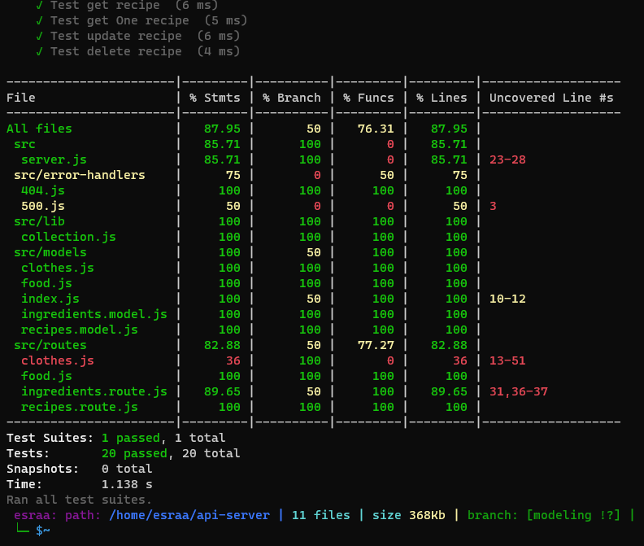

# api-server
[server online](https://esraa-api-server.onrender.com)

[Pull request](https://github.com/esraaobeido/api-server/pull/3)

[Github Action](https://github.com/esraaobeido/api-server/actions)

## Description
In this lab, I have created two tables, recipes and ingredients, added a association with food tableو where
The food table has a one-to-one relation with the ingredients table, This means that each type of food has only one ingredient By setting a food id is foreign key in ingredient table, it returns to food table.
On the other hand, The food table has one-to-many relatiom with recipes tableو Because one type of food can have more than one recipe. 

- **The image below shows the relationship between the tables.** 

- **Results of the tests.** 

